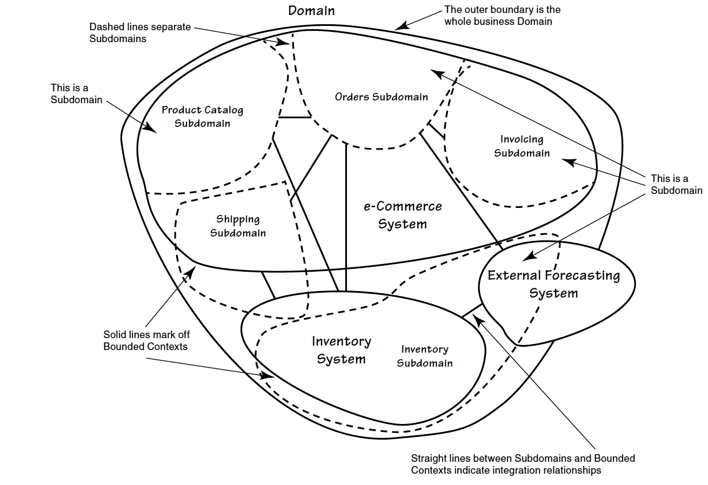

# 领域驱动设计简介

# 一、理解领域驱动设计

## 1. 什么是领域驱动设计

领域驱动设计是一种软件开发方法，它专注于构建一套充分体现业务规则和流程的领域模型，并以此来构建复杂的软件系统。

领域驱动设计主要关注：

1. 将领域专家与开发人员聚集到一起，使软件能够反映出领域专家的思维模型，从而交付最有价值的软件。
2. 关注业务战略方向，清楚地界定业务关注点。
3. 使用战术设计工具使得软件具备良好的架构和可测性。

**通用语言**（Ubiquitous Language）和**界限上下文**（Bounded Context）构成了领域驱动的两大支柱。

## 2. 领域专家

领域专家并不是一个特定职位，他可以是精通业务的任何人。他们可能了解更多的关于业务领域的背景知识，他们可能是产品经理，甚至可能是销售人员，等等。

## 3. 领域模型

领域模型是关于某个特定业务领域的软件模型。通常，领域模型通过对象模型来实现，这些对象同时包含了数据和行为，并且表达了准确的业务含义。

## 4. 通用语言

通用语言是开发团队内部形成的公共语言，在开发团队与领域专家之间，通用语言应该是无歧义的。

## 5. 界限上下文

界限上下文是软件内部一个概念性边界，在此边界内通用语言都有明确的上下文含义。

## 6. 领域驱动设计的适用场景

领域驱动设计适用于重要、复杂、核心业务领域的软件开发，不是所有场景都适合。

记分卡：你的项目是否能得到7分或者7分以上？如果不能则可能不适合领域驱动开发。

| 如果你的项目...                                        | 得分 |
| :----------------------------------------------------- | :--- |
| 完全以数据为中心，所有操作都通过对数据库的CRUD完成。   | 0    |
| 只有25到30个业务操作，或者少于30个用户故事             | 1    |
| 有30到40个用户故事或者用例                             | 2    |
| 当前不算复杂，但是后续会变得很复杂                     | 3    |
| 在接下来的几年内功能会不断进行变化，而现在无法预期变化 | 4    |
| 开发团队不了解业务领域知识                             | 5    |

## 7. 领域驱动设计的业务价值

领域驱动设计能带来的业务价值包括：

1. 你获得了一个非常有用的领域模型
2. 你的业务得到了更准确的定义和理解
3. 领域专家可以为软件设计做出贡献
4. 更好的用户体验
5. 清晰的模型边界
6. 更好的企业架构
7. 敏捷、迭代和持续建模
8. 使用战略和战术工具

## 8. 领域驱动设计面临的挑战

应用领域驱动开发，通常会面临如下挑战：

1. 需要花费大量时间和精力来创建统一语言；
2. 需要持续依靠领域专家参与到项目中；
3. 需要改变开发人员的思维方式和工作习惯；

## 9. 领域驱动与敏捷过程相结合

领域驱动设计本身可以和敏捷相结合，体现"测试现行，逐步改进"的思路。

比如，在开发一个新的实体对象时，可以：

1. 编写测试代码以模拟客户代码是如何使用该领域对象的。
2. 创建该领域对象以使测试代码能能够编译通过。
3. 同时对测试和领域对象进行重构，直到测试代码能够正确地模拟客户代码，同时领域对象拥有能够表明业务行为的方法签名。
4. 实现领域对象的行为，直到测试通过为止，再对实现代码进行重构。
5. 向你的团队成员展示代码，包括领域专家，以保证领对象能够正确地反应通用语言。

## 10. 贫血领域模型（Anemic Domain Object）

贫血领域模型是一个缺乏行为的领域对象。可以通过下表来判断：

| 特征                                                         | Yes or No |
| :----------------------------------------------------------- | :-------- |
| 领域对象主要包含getter和setter方法，几乎没有业务逻辑，主要作为数据的“容器”。 |           |
| 在服务层（Service）或应用层（Application Layer）中经常需要调用getter和setter方法。 |           |

如果上述两个问题的答案都是No，则领域模型是健康的，否则就是贫血模型。

贫血模型是坏处就在于投入很大而收益很小，且容易形成“大泥球”！

代码示例：

```java
public class BacklogItemPresentationModel extends AbstractPresentationModel {
    @Transactional
    public void saveCustomer(
                              String customerId, 
                              String customerFirstName, 
                              String customerLastName, 
                              String streetAddress1, 
                              String streetAddress2, 
                              String city, 
                              String stateOrProvince, 
                              String postalCode, 
                              String country, 
                              String homePhone, 
                              String mobilePhone, 
                              String primaryEmailAddress, 
                              String secondaryEmailAddress) {
        Customer customer = customerDao.readCustomer(customerId);
        if (customer == null) {
            customer = new Customer();
            customer.setCustomerId(customerId);
        }
        customer.setCustomerFirstName(customerFirstName);
        customer.setCustomerLastName(customerLastName);
        customer.setStreetAddress1(streetAddress1);
        customer.setStreetAddress2(streetAddress2);
        customer.setCity(city);
        customer.setStateOrProvince(stateOrProvince);
        customer.setPostalCode(postalCode);
        customer.setCountry(country);
        customer.setHomePhone(homePhone);
        customer.setMobilePhone(mobilePhone);
        customer.setPrimaryEmailAddress(primaryEmailAddress);
        customer.setSecondaryEmailAddress(secondaryEmailAddress);
        customerDao.saveCustomer(customer);
    }
}
```

VS

```java
public interface Customer {
        public void changePersonalName(String firstName, String lastName);
        public void postalAddress(PostalAddress postalAddress);
        public void relocateTo(PostalAddress changedPostalAddress);
        public void changeHomeTelephone(Telephone telephone);
        public void disconnectHomeTelephone();
        public void changeMobileTelephone(Telephone telephone);
        public void disconnectMobileTelephone();
        public void primaryEmailAddress(EmailAddress emailAddress);
        public void secondaryEmailAddress(EmailAddress emailAddress);
    }
```

```java
    @Transactional
    public void changeCustomerPersonalName(
        String customerId, 
        String customerFirstName, 
        String customerLastName) 
    {
        Customer customer = customerRepository.customerOfId(customerId);
        if (customer == null) {
            throw new IllegalStateException("Customer does not exist.");
        }
        customer.changePersonalName(customerFirstName, customerLastName);
    }
```


# 二、领域、子域和界限上下文

## 1. 领域

领域（Domain）是一个组织的业务范围以及其中所进行的活动。

子域（Subdomain）是领域的组成部分，他提供了领域当中的某种具体功能，领域与子域是相对的。

核心子域（Core Domain）是决定业务成败关键子域。

支持子域（Supporting Domain）是重要但非核心的子域。通用子域（Generic Domain）是用于整个系统的子域。

例如，一个电商系统中，可能包含如下子域：产品目录（Product Catalog），订单（Order）、发票（Invoice）和物流（Shipping）。 



## 2. 问题空间（Problem Space）与解决方案空间（Solution Space）

问题空间是业务所面临的挑战，它是领域的一部分，对问题空间的开发将产生一个新的核心子域。问题空间是核心子域与其他子域的组合。

解决方案空间是应对业务挑战的软件解决方案，它包括一个或者多个界限上下文。因为界限上下文体现了一种特定的解决方案。

## 3. 界限上下文

界限上下文是领域模型以及模型之间的关系、规则所存在的边界。

界限上下文和子域并非一一对应，一个子域可能有多个界限上下文，一个界限上下文中也可能包含多个子域的概念。当然，一种理想的情况就是一个子域中只包含一个界限上下文。


## 4. 理解界限上下文

### 4.1 界限上下文是显示的，充满语义的

界限上下文是一个显式边界，领域模型存在于边界之内。在边界之内，通用语言中的所有术语和词组都有特定的含义，而模型需要准确地反应通用语言。

举例：同样是账户（Account）在银行上下文和电商上下文中所代表的含义就不一致。

### 4.2 界限上下文不仅仅包含模型

界限上下文并不止局限于容纳模型，它通常也定义了一个系统，一个应用程序或者一种服务。

例如，如果模型驱动着数据库Schema的设计，那么Schema应该处于界限上下文之内。

### 4.3 界限上下文的大小

界限上下文应该足够大，以能够表达他所对应的整套通用语言。通用语言以外的概念不应该包含在界限上下文中。

不应该为了匹配架构组件、团队职责、开发人力而破坏界限上下文的边界。

### 4.4 界限上下文与技术组件保持一致

将界限上下文想成技术组件并无大碍，只是我们需要记住：技术组件并不能定义界限上下文。

例如，使用Java时，顶层包名称通常表示界限上线文中顶层模块的名字。

# 三、上下文映射图

## 1. 什么是上下文映射图？

上下文映射图是软件项目中的界限上下文和他们之间的集成关系图。

上下文映射图可以用于解决集成问题，还可以促进团队之间的交流，甚至用于识别阻碍项目进展的管理问题。

上下文隐身图不是一种企业架构图，也不是系统拓扑图，但是它可以用于高层次的架构分析，支持解决架构的不足。

## 2. 绘制上下文映射图

首选在白板上手绘映射图，一般不考虑正式的UML图。

首先，在白板上画出一个区域作为界限上下文，选择性地将相关类的属于填写在上面。

然后，根据界限上下文之间的组织模式和集成模式绘制关系。


## 3. 界限上下文关系类型

- **合作关系（Partnership）**

​      如果两个界限上下文的团队要么一起成功，要么一起失败，此时他们需要建立一种合作关系。

- **共享内核（Shared Kernel）**

​      对模型和代码的共享将产生一种紧密的依赖性，我们需要为共享的部分模型指定一个显示的边界，并且保持共享内核的小型化。

- **客户方-供应方开发（Customer-Supplier Development)**

​     上游团队可能独立于下游团队完成开发，此时下游团队的开发可能受到很大的影响。

- **尊奉者（Conformist）**

​     在存在上游-下游关系的两个团队中，如果上游团队已经没有动力提供下游团队所需，下游团队便孤军无助了。下游团队只能盲目的使用上游团队的模型。

- **防腐层（ACL，Anti-Corruption Layer）**

​     下游系统根据自己的领域模型创建一个单独的层，该层作为上游系统的代理向下游系统提供功能。

- **开放主机服务（OHS，Open Host Service）**

​     定义一种协议，让你的子系统通过该协议来访问你的服务。

- **发布语言（PL，Published language)**

​     在两个界限上下文之间翻译模型需要一种公用的语言。

- **另谋他路（Separate Way）**

​     如果两套功能没有显著的关系，那么他们是可以被完全解耦的。

- **大泥球（Big Ball Of Mud）**

​     系统中存在混杂在一起的模型，他们之间的边界非常模糊。

# 四、架构

## 1. 领域驱动与架构

领域驱动设计的一大好处就是它并不需要使用特定的架构。由于核心子域位于界限上下文中，我们可以自由地使用各种架构风格。

无论选择哪一种架构风格和模式，都受到功能需求的约束，比如用例和用户故事。

## 2. 分层架构

分层架构被认为是所有架构的始祖。

在分层架构中，我们将领域模型和业务逻辑隔离开，消除领域模型基础设施、用户界面，甚至是应用逻辑的依赖。将一个复杂的

程序分成多个层，使得每一个层都有良好的内聚性，并且只依赖于其以下的层。

- **严格分层架构（Strict Layers Architecture)**

​     每一层只与直接位于其下方的层耦合。

- **松散分成架构（Relaxed Layers Architecture)**

​     允许上方层与任意下方层耦合。

分层架构的一个重要原则就是每层只能与下方层发生耦合，绝对不允许较低地层访问较高的层。仅有的例外是Observer和Mediator模式。


### 2.1 用户界面层

用户界面层用于处理用户显示和用户请求，它不应该包含领域知识或者业务逻辑。当用户界面试图使用领域对象的数据时，

应该考虑使用展现模型（Presentation Model) 对用户界面和领域对象进行解耦。

用户界面层是应用层的直接客户。

### 2.2 应用层

应用层中主要包含应用服务，应用服务本身并不处理领域相关的业务逻辑，他轻量的，用于对外协调对领域对象的操作。

应用服务时表达用例和用户故事的主要手段。

应用层的通常用法是：

- 接收来自于用户界面的输入参数，通过资源库（Repository）获取聚合实例，然后执行响应的命令操作；
- 当需要创建新的聚合时，应用服务应该使用工厂或者聚合的构造方法来实例化对象，然后调用资源库对其进行持久化；
- 应用服务还可以调用领域服务来完成领域相关的任务操作，但此时的操作应该是无状态的；
- 应用服务还可以用于订阅领域事件，然后对领域事件进行存储的转发，这样可以是领域模型不依赖于消息机制和基础设施；

样例代码：

```java
@Transactional
public void commitBacklogItemToSprint(String aTenantId, String aBacklogItemId, String aSprintId) {
        TenantId tenantId = new TenantId(aTenantId);
        BacklogItem backlogItem = backlogItemRepository
                          .backlogItemOfId(tenantId, new BacklogItemId(aBacklogItemId));
        Sprint sprint = sprintRepository.sprintOfId(tenantId, new SprintId(aSprintId));
        backlogItem.commitTo(sprint);
    }
```

如果应用服务比上述功能复杂许多，这通常意味着领域逻辑已经渗透到应用服务中，此时领域模型会变成贫血模型。

### 2.3 基础设施层

基础设施层位于底层，包括持久化和消息机制等。

基础设施层是应用的底层服务，高层与该层耦合以实现重用资源。但是，要避免领域对象和基础设施层发生直接耦合。

例如，资源库接口的实现需要基础设施层提供持久化机制，如果将资源库接口定义在基础设施层就导致了直接耦合。

解决方法就是将资源库接口定义在应用层，将实现放在基础设施层中。

### 2.4 依赖反转

依赖反转（Dependency Inversion）可以改善分层架构。

正如其定义：高层模块不依赖于底层模块，两者都依赖于抽象；抽象不依赖于细节，细节应该依赖于抽象。

## 3. 六边形架构

六边形架构，也叫做端口与适配器，在这种架构中不同的外部用户以平等的方式与系统交互。对于每一种外部访问都存在

一个适配器，适配器将外部请求转换为对内部API的调用。

六边形架构下，我们根据用例来设计应用程序，而不管客户。客户可以向不同端口发起请求，但是无论哪种请求都被适配器

转换为对于内部API的调用。


在六边形架构中，端口是多种多样的，且未必都需要自己实现。例如：

- Restful接口可以看做是一个HTTP的端口；
- Kafka的Listener可以看做是 一个消息端口；

## 4. 面向服务架构

面向服务的架构（SOA）存在多种理解，但通常除了指应用之间通过服务接口进行互操作外，一般还要符合如下原则：

- 服务契约：通过契约文档，服务阐述自身的目的与功能。
- 松耦合：服务之间依赖关系最小化。
- 服务抽象：服务只发布契约，而向客户隐藏内部逻辑。
- 服务重用：一个服务可以被多个用户使用。
- 服务自治：服务自行控制环境与资源以保持独立。
- 无状态：服务方没有状态，状态管理的职责在客户端。
- 可发现：服务可以通过配置数据发现。
- 组合性：服务可以由粒度更小的服务组合而成。

我们可以将这些原则和六边形架构结合起来，此时服务边界位于最左边，而领域模型位于中心位置。


### 5. REST

REST也可以看做是一种架构风格，在这里我们不在赘述其特征。

如果将Restful接口与领域驱动设计相结合，那么通常不能直接在Restful接口暴露领域模型。一种方法就是，为Restful接口创建一个

界限上下文，在此上下文中访问实际的核心模型。

代码示例：

```java
@Path("/tenants/{tenantId}/products")
public class ProductResource extends Resource {
    private ProductService productService;

    @GET
    @Path("{productId}")
    @Produces({"application/xml"})
    public Product getProduct(@PathParam("tenantId") String aTenantId,                                                 @PathParam("productId") String aProductId, 
                              @Context Request aRequest) {
            Product product = productService.product(aTenantId, aProductId);
            if (product == null) {
                throw new WebApplicationException(Response.Status.NOT_FOUND);
            }
            return product; // serialized to XML using MessageBodyWriter        }    }
        }
    }
```

### 6. 事件驱动架构

事件驱动架构（Event-Driven Architecture)是一种推崇使用事件进行触发、检测、处理和响应的软件架构。

我们可以将六边形架构的系统看做事件驱动架构的其中一个参与方。例如，领域事件通过通过一个输出适配器发布，

传输到另外一个系统，使用这个系统的输入适配器进入。


# 五、实体

## 1. 实体的定义

实体是拥有唯一标识并且具备持续可变性的对象。

## 2. 唯一标识

实体的唯一性仅通过唯一标识确定，而不是其次要的属性和行为。

唯一标识的生成可以发生在对象创建时，也可以发生在持久化对象时。

有些ORM工具会生成自己的唯一标识，通常被称作委派标识（surrogate identity)。此时为了避免冲突，我们还需要一种领域相关的唯一标识。

唯一标识具备稳定性，即唯一标识一旦生成就是不可修改的。

常见的创建唯一标识的策略包括：1）用户提供唯一标识；2）程序生成唯一标识；3）持久化机制生成唯一标识；4）另外一个界限上下文提供唯一标识。

## 3. 实体及其本质特征

在通用语言中，名词用于给概念命名，形容词用于描述这些概念，而动词则表示可以完成的操作。

如果可以通过唯一标识来识别这些概念，那么它很有可能是一个实体，描述这个概念的形容词对应着实体的属性，在这些概念上可以完成的操作形成了实体的行为。

通过面向对象的方法，我们很容易创建出一个对应的实体类。


## 4. 构造实体对象

当创建一个实体对象时，我们希望通过构造函数来初始化足够多的实体状态。

唯一标识的生成存在两种策略：先生成唯一标识，再进行持久化；利用持久化机制后生成唯一标识。


在构造过程中，不但需要验证实体的单个属性是否处于合法状态，还需要验证整体属性是否合法。


```java
public class User extends Entity {
    protected void setUsername(String aUsername) {
        if (this.username != null) {
            throw new IllegalStateException("The username may not be changed.");
        }
        if (aUsername == null) {
            throw new IllegalArgumentException("The username may not be set to null.");
        }
        this.username = aUsername;
    }
}
```


# 六、值对象

## 1. 值对象的特征

当你决定一个领域概念是否是一个值对象时，你需要考虑他是否拥有以下特征：

1. 它度量或者描述了领域中一件东西。
2. 它可以作为不变量。
3. 它将不同的相关属性组合成一个概念整体。
4. 当度量和描述改变时，可以用另一个值对象进行替换。
5. 它可以和其他值对象进行相等性比较。
6. 它不会对协作对象造成副作用（Size Effect）。

## 2. 最小化集成

当一个概念在界限上下文之间流动时，使用值对象来表示这些概念可以达到最小化集成。

## 3. 使用值对象来表示标准类型

一个系统中存在表示事物的实体和描述实体的值对象，还存在用来区分不同类型的类型码。类型码通常无法传递足够的信息，所以需要使用一种特殊的值对象来替代。


# 七、领域服务

## 1. 什么是领域服务

领域服务不是远程的服务。

当领域中的某个操作过程或者转换过程不是实体或者值对象的职责时，我们通常将这种操作放到一个单独的接口中，即领域服务。

领域服务和通用语言是一致的，并且是无状态的。

领域服务可以用来：

1. 执行一个显著的业务操作过程。
2. 对领域对象进行转换。
3. 以多个领域对象作为输入进行计算，结果产生一个值对象。

## 2. 确定是否需要领域服务

只有在必要时才应该创建领域服务，过度使用领域服务奖导致贫血模型，即所有的业务逻辑都位于领域服务中，而不是实体和值对象中。

## 3. 构建领域服务

根据领域服务的目的，我们很容易对领域服务进行建模。你要决定的是是否需要一个独立接口。如果有依赖注入或者工厂，且领域服务在技术上没有其他实现，则也可以不用接口而直接使用类。


```java
package com.saasovation.identityaccess.domain.model.identity;

public interface AuthenticationService {
    public UserDescriptor authenticate(TenantId aTenantId, String aUsername, String aPassword);
}
```


```java
import com.saasovation.identityaccess.domain.model.DomainRegistry;
import com.saasovation.identityaccess.domain.model.identity.AuthenticationService;
import com.saasovation.identityaccess.domain.model.identity.Tenant;
import com.saasovation.identityaccess.domain.model.identity.TenantId;
import com.saasovation.identityaccess.domain.model.identity.User;
import com.saasovation.identityaccess.domain.model.identity.UserDescriptor;

public class DefaultEncryptionAuthenticationService implements AuthenticationService {
    public DefaultEncryptionAuthenticationService() {
        super();
    }

    @Override
    public UserDescriptor authenticate(TenantId aTenantId, String aUsername, String aPassword) {
        if (aTenantId == null) {
            throw new IllegalArgumentException("TenantId must not be null.");
        }
        if (aUsername == null) {
            throw new IllegalArgumentException("Username must not be null.");
        }
        if (aPassword == null) {
            throw new IllegalArgumentException("Password must not be null.");
        }
        UserDescriptor userDescriptor = null;
        Tenant tenant = DomainRegistry.tenantRepository().tenantOfId(aTenantId);
        if (tenant != null && tenant.isActive()) {
            String encryptedPassword = DomainRegistry.encryptionService().encryptedValue(aPassword);
            User user = DomainRegistry.userRepository().userFromAuthenticCredentials(aTenantId, aUsername, encryptedPassword);
            if (user != null && user.isEnabled()) {
                userDescriptor = user.userDescriptor();
            }
        }
        return userDescriptor;
    }
}
```


# 八、领域事件

领域事件是领域专家所关心的发生领域中的一些事件。如果在与领域专家沟通时发生“当......的时候，请通知我”则预示这是一个领域事件。

领域事件具有唯一标识，既可以在界限上下文内部发布，也可以发布到远程的界限上下文中。


# 九、模块

## 1. 什么是模块？

模块表示一个命名容器，用于存放领域中内聚在一起的类。模块的名称是通用语言的重要组成部分。

模块应该包含一组具有高内聚性的概念集合，这样做的好处是可以在不同的模块之间实现松耦合。

## 2. 设计模块的简单原则

1. 模块应该和领域概念保持一致。
2. 根据通用语言来命名模块。
3. 不要机械式的根据通用的组件类型和模式来创建模块。
4. 设计松耦合的模块。
5. 当同层模块出现耦合是，应该杜绝循环依赖。
6. 父模块与子模块之间放松原则。
7. 不要将模块设计成一个静态概念，而是与模型中的对象一起进行建模。

# 十、聚合

## 1.聚合的定义

聚合不是简单地将一些共享父类或者密切关联的对象聚合成一个对象树。


## 2. 原则：一致性边界之内的不变条件。

不变条件表示一个业务规则，该规则总是保持一致。典型不变条件就是事务一致性和最终一致性。

聚合边界内的所有内容组成了一套不变的业务规则，任何操作都不能违背这些规则。该边界外的任何操作都与该聚合无关，因此聚合表达了与事务一致性边界相同的意思。

一个重要的原则，就是在一个事务中只修改一个聚合实例。

## 3. 原则：设计小聚合

在极端情况下，一个聚合只拥有全局标识和单个属性。但是，通常情况下我们使用根实体（Root Entity）来表示聚合，其中只包含最小数量的属性或者值类型属性。

判断被包含的概念是实体还是值对象，应该依据：被包含概念是否会随着时间的变化而变化，该部分是否能够被全部替换？如果是则应该使用值对象。

有时，将被包含概念建模成实体也是有必要的。但是，大部分情况都可以将实体重构成值对象。

## 4. 原则：通过唯一标识引用其他聚合

优先考虑通过全局唯一标识来引用外部聚合，而不是通过直接的对象引用。

在使用聚合行为方法之前，我们可以使用资源库和领域服务来获取所需要对象。

但是，无论如何引用聚合，都不能再同一个事务中修改多个聚合实例。

## 5. 原则：在边界之外使用最终一致性

当在一个聚合上执行命令方法是，如果还需要在其他聚合上执行额外的业务规则，那么请使用最终一致性。

## 6. 打破原则的理由

如果一定要选择在单个事务中更新多个聚合实例，请确保有充分的理由。

理由之一：方便用户界面，用户界面允许以此修改多个业务对象。

理由之二：缺乏技术机制，缺乏消息、定时器、后台线程之类的技术。

理由之三：全局事务，技术与政策限制了只能使用全局事务保证强一致性。

理由之四：查询性能，减少查询次数，提升查询效率，从导致一个聚合中之间引用其他聚合。

## 7. 实现聚合

- 创建具有唯一标识的根实体
- 优先使用值对象
- 使用最小知道原则和告诉而非询问原则
- 乐观并发：
- 避免依赖注入：不要在聚合中注入资源库或者领域服务


# 十一、 工厂

## 1. 领域模型中的工厂

将创建复杂对象和聚合的职责分配给一个单独的对象，该对象本身并不承担领域模型中的职责，但仍然是领域设计中的一部分。

一个含有工厂方法的聚合根的主要职责时完成它的聚合行为，而工厂方法只是其中之一。

## 2. 领域服务中的工厂

领域服务可以扮演工厂的角色，即提供工厂方法用于创造聚合根。

```java
package com.saasovation.collaboration.domain.model.collaborator;

import com.saasovation.collaboration.domain.model.tenant.Tenant;

public interface CollaboratorService {
    public Author authorFrom(Tenant aTenant, String anIdentity);
    public Creator creatorFrom(Tenant aTenant, String anIdentity);
    public Moderator moderatorFrom(Tenant aTenant, String anIdentity);
    public Owner ownerFrom(Tenant aTenant, String anIdentity);
    public Participant participantFrom(Tenant aTenant, String anIdentity);
}
```


# 十二、 资源库

## 1. 什么是资源库（Repository）？

资源库通常表示一个安全的存储区域，并且对其中所存放的物品起保护作用。我们通常将聚合实例存放在资源库中，之后再通过该资源库来获取相同的实例。

通常，聚合类型和资源库之间存在着一对一的关系，每一种聚合类型都将拥有一个资源库。


## 2. 面向集合资源库

资源库模拟了一个集合，从接口上看不出其背后的持久化机制，也看不出我们想存储区域中存储了数据。

集合型的资源库应该模拟为一个Set集合，不允许重复实例，如果发生修改需要重新保存。

```java
public class CalendarRepository extends HashSet {
    private Set<CalendarId, Calendar> calendars;

    public CalendarRepository() {
        this.calendars = new HashSet<CalendarId, Calendar>();
    }

    public void add(Calendar aCalendar) {
        this.calendars.add(aCalendar.calendarId(), aCalendar);
    }

    public Calendar findCalendar(CalendarId aCalendarId) {
        return this.calendars.get(aCalendarId);
    }
}
```


## 3. 面向持久化资源库

如果集合资源库不支持对对象变化的跟踪，我们可以使用面向持久化的资源库。这是一种基于保存操作的资源库，每次新建或者修改聚合后，都需要调用save()方法持久化状态。


```java
package com.saasovation.agilepm.domain.model.product;

import java.util.Collection;

import com.saasovation.agilepm.domain.model.tenant.Tenant;

public interface ProductRepository {
    public ProductId nextIdentity();
    public Collection<Product> allProductsOfTenant(Tenant aTenant);
    public Product productOfId(Tenant aTenant, ProductId aProductId);
    public void remove(Product aProduct);
    public void removeAll(Collection<Product> aProductCollection);
    public void save(Product aProduct);
    public void saveAll(Collection<Product> aProductCollection);
}
```


## 4. 资源库 vs 数据访问对象（DAO）

DAO主要从数据库表的角度看待问题，其相关的模式包括表模块（Table Module）、表数据网关（Table Data Gateway）和活动记录（Active Record），这些模式应该用于事务脚本程序。

资源库与数据映射器（Data Mapper）更加偏向于对象，因此通常被用于领域模型中。

在设计资源库时，我们应该采用面向集合的方式，而不是面向数据访问的方式，这有助于将自己的领域当做模型来看待，而不是CRUD。

另外，在数据库中放置并执行逻辑是违背领域驱动的思想的，比如存储过程。

## 5. 测试资源库

如果在测试阶段准备一个完整的资源库实现比较困难，或者太慢，则可以考虑在建模早期就在用一个内存版本的资源库实现来进行测试。

# 十三、集成界限上下文

## 1. 集成的基础知识

- 远程方法调用（RPC）

​     在一个界限上下文中暴露应用编程接口，然后再另一个界限上下文中通过远程调用的方式访问该API。例如通过SOAP，HTTP+XML，gRPC等。

- 消息队列

​     在一个需要交互的系统中使用消息队列或者发布订阅机制。

- Restful API

​     Restful和RPC相似，但是Restful更偏向于资源交互。

## 2. 分布式系统面临的挑战

1. 网络是不可靠的。
2. 总会存在时间延迟，有时甚至非常严重。
3. 带宽是优先的。
4. 不要假设网络是安全的。
5. 网络拓扑结构会发生变化。
6. 知识和政策在多个管理员之间传播。
7. 网络传输是有成本的。
8. 网络是异构的。

# 十四、应用程序

## 1. 什么是应用程序？

   在领域驱动设计中，应用程序表示那些支撑何新宇的模型组件，通常包括领域模型本身、用户界面、内部使用的应用服务和基础设施组件等。


## 2. 用户界面

Web 1.0 ：纯粹响应请求式的界面。

Web 2.0：富互联网应用，包括使用AJax、GWT、Flex等创建的交互性强的页面。

本地客户端GUI：桌面应用程序。

## 3. 渲染领域对象

### 3.1 数据传输对象（DTO）

应用服务通过资源库读取所需要的聚合实例，然后使用一个DTO组装器将所需要的属性值映射到DTO中，然后用户界面组件将访问每一个DTO属性，并将其渲染到显示界面中。

优点：

- 因为DTO组装器直接访问聚合中DTO所需要的数据，所以不存在延迟；
- 可以解决展现层和业务层存在物理分离的情况，即序列化后通过网络传输；

缺点：

- DTO是一些与领域对象十分相似的类，如果展现层不是远程的，则带来了不必要复杂性；

### 3.2 使用调停者发布聚合的内部状态

客户端将实现调停者接口，然后将实现对象的引用作为参数传给聚合，然后，聚合双分派给调停者以发布自身状态，在这个过程中聚合并没有暴露自身的内部结构。

### 3.3 使用DPO渲染聚合实体

在单个JVM中，我们可以采用与DTO类似的DPO，DPO中包含了对整个聚合实例的引用，而不是单独的属性。

应用服务通过资源库获取到所需的实例，然后创建DPO实例，该DPO次优对所有聚合实例的引用，然后，展现层通过DPO获得聚合实例的引用，再从聚合中访问需要显示的属性。

### 3.4 用例优化资源库查询

我们可以在资源库中创建一些查询方法，这些方法返回的是所有聚合实例属性的超集，查询方法动态地将查询结果放在一个值对象中，这个值对象将直接用于渲染界面。


```java
public class BacklogItemPresentationModel extends AbstractPresentationModel {
    private BacklogItem backlogItem;

    public BacklogItemPresentationModel(BacklogItem aBacklogItem) {
        super();
        this.backlogItem = backlogItem;
    }

    public String getSummary() {
        return this.backlogItem.summary();
    }

    public String getStory() {
        return this.backlogItem.story();
    } ...
}
```


## 4. 应用服务

应用服务是领域模型的直接客户。应用服务负责用例流的任务协调，每个用例流对应了一个服务方法。应用服务还负责控制事务。

应用服务于领域服务时完全不相同的:

- 领域服务粒度更细，应用服务提供了一种Facade；
- 领域服务包含了领域逻辑，而这种逻辑不能自然存在于实体对象中；而应用服务编排了领域逻辑的执行，但是其自身却不实现领域逻辑；
- 领域服务的方法可以使用领域概念作为参数和返回值；应用服务的参数和返回值通常是基本类型、唯一标识和值类型；
- 应用服务依赖于基础服务，从而可以调用领域逻辑；


```java
package com.saasovation.identityaccess.application;

public interface TenantIdentityService {
    public void activateTenant(TenantId aTenantId);

    public void deactivateTenant(TenantId aTenantId);

    public String offerLimitedRegistrationInvitation(TenantId aTenantId, Date aStartsOnDate, Date anUntilDate);

    public String offerOpenEndedRegistrationInvitation(TenantId aTenantId);

    public Tenant provisionTenant(String aTenantName, String aTenantDescription, boolean isActive, FullName anAdministratorName, EmailAddress anEmailAddress, PostalAddress aPostalAddress, Telephone aPrimaryTelephone, Telephone aSecondaryTelephone, String aTimeZone);

    public Tenant tenant(TenantId aTenantId); 
    ...
}
```


## 5. 组合多个界限上下文

当用户界面需要多个界限上下文中的数据时，最简单的方法是创建一个单一的应用层，并使该应用层来组合多个模型。

这个应用层中的服务并不包含领域逻辑，它的唯一功能就是讲不通模型中的聚合对象组合成用户界面所需要的内聚对象。

此时，应用层对多个DTO进行了合并，产生的结果有点像贫血模型，这种方式也有点像事务脚本。


## 6. 基础设施

基础设施的职责是为应用程序的其他部分提供技术支持。

应用服务获取资源时，它只会依赖于领域模型的接口，而实际使用的是基础设施中提供的实现类。

# 十五、总结

本文的主要内容来自于对《Implementing Domain Driven Design》的总结，主要倾向于介绍领域驱动设计的基础概念。实际上原书中有。

建议感兴趣的读者可以仔细阅读原版。另外，本书的中文版叫做《实现领域驱动设计》，需要注意某些内容的翻译并不准确。

